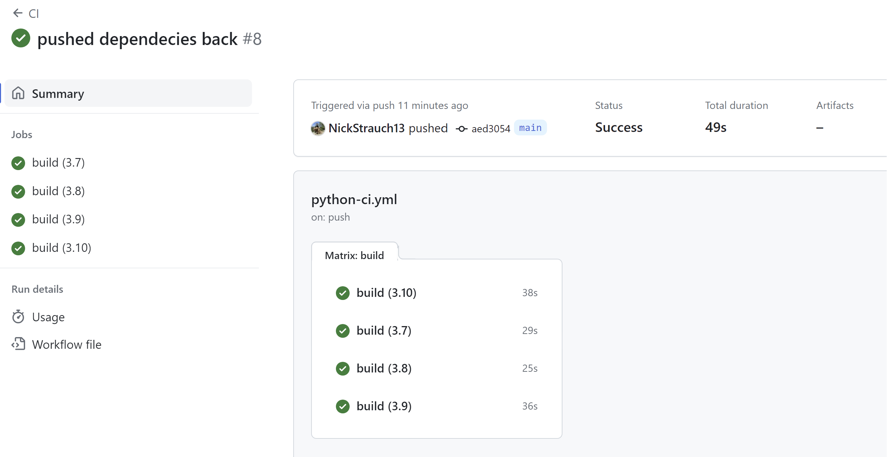
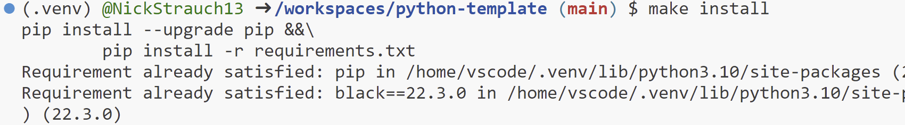
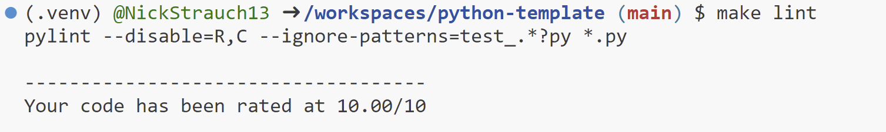
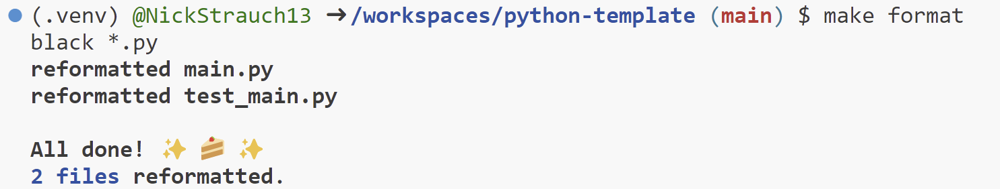
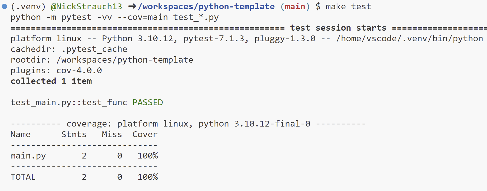

# IDS706 Mini-Project 4
 **- Python-3.7**

 **- Python-3.8**

 **- Python-3.9**

 **- Python-3.10**
 
---

---
This repository is designed to utilize GitHub Actions for testing various Python versions and operating systems. It leverages a Matrix strategy to concurrently execute multiple testing tasks, enhancing efficiency.

``Matrix testing`` ensures that any potential compatibility issues are identified early in the development process, reducing the likelihood of encountering unexpected errors in production. This systematic approach also allows for smoother collaboration among team members, as it provides a standardized testing framework across different development environments.

## About the template
- Inside the ``.devcontainer`` directory, you'll find a Dockerfile and devcontainer.json. The Dockerfile outlines how to construct the container, while other settings in this directory manage the development environment configuration.

- The ``.github/workflows`` directory houses GitHub Actions configurations, enabling the setup of automated pipelines for building, testing, and deploying your project. This is where the matrix strategy is defined.

- The ``.gitignore`` file is utilized to specify which files or directories should be excluded from version control when utilizing Git.

- A ``Makefile`` is present as a configuration file designed for automating tasks and facilitating software building in Unix-based systems. It contains instructions and dependencies for tasks like code compilation, test execution, and other development processes.

- The ``requirements.txt`` file is used to define the project's dependencies, including libraries and packages needed for its execution.

- For testing purposes, there's a ``test_main.py`` file designed to work seamlessly in various Integrated Development Environments (IDEs).

- The ``img`` directory is used to store any result images.

## GitHub Actions
GitHub Actions is used to run the Makefile in this order: `make install`, `make lint`, `make format`, `make test`.

``Makefile`` recipe results:
***

***

***

***

